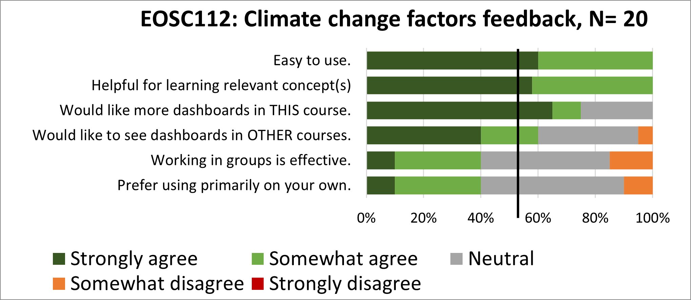

# EOSC 112

## Official course description

**The Fluid Earth: Atmosphere and Ocean**: Introduction to processes in ocean and atmosphere. Heat, current, winds, clouds, marine life, resources. Effects of coupling, climate change, pollution.

**Links:**
\>[Home](https://www.eoas.ubc.ca/academics/courses/eosc112),
\>[UBC Calendar](https://courses.students.ubc.ca/cs/courseschedule?pname=subjarea&tname=subj-course&dept=EOSC&course=112),
\>[ubcexplore](https://ubcexplorer.io/course/EOSC/112).

## OCESE project objectives

* Support development, implementation and evaluation of new activities funded by UBC's climate science initiative.

## Resources produced

* Grad students hired for this project develop ideas and OCESE considered options for implementation.
* Completed the [Global Temperature Anomaly](dashboards.md) dashboard used in eosc112 and several other courses.
* A second dashboard ([climate-mind-map](dashboards.md)) was concieved and prototyped, but implementation was put off for a later time.
* Supported development, observed implementation, and coordianted evaulation of an activity based on the IPCC Climate Atlas for EOSC 112 (147 students).

## Pedagogy

The IPCC Climate Atlas activity was worksheet-based. Begun in class, students could work in groups or alone. Getting-started instruction were provided by lecture and instructors & TAs then circulated to ensure students were making progress. The assignment was completed at home with responses delivered to the course's Canvas site for assessment as PDFs or scanned images.

## Project evaluation

These **feedback questions** were posed to students as the last step in their assignment:

* What have you learned by working on this activity?
* Were you surprised by anytyhing you observed?
* What is one question you have that was inspired by this activity?

Open ended responses were analyzed to find commonalities and to identify particularly thoughtful or information statements from students. 

Results from student feedback about the IPCC Climate Atlas activity are summarized in a <a href="files/ClimateAtlas-reflections-summary.pdf">**separate PDF file**</a>.

Student feedback regarding dashboard use was limited as completing the short survey was optional. Results are in the figure below.

