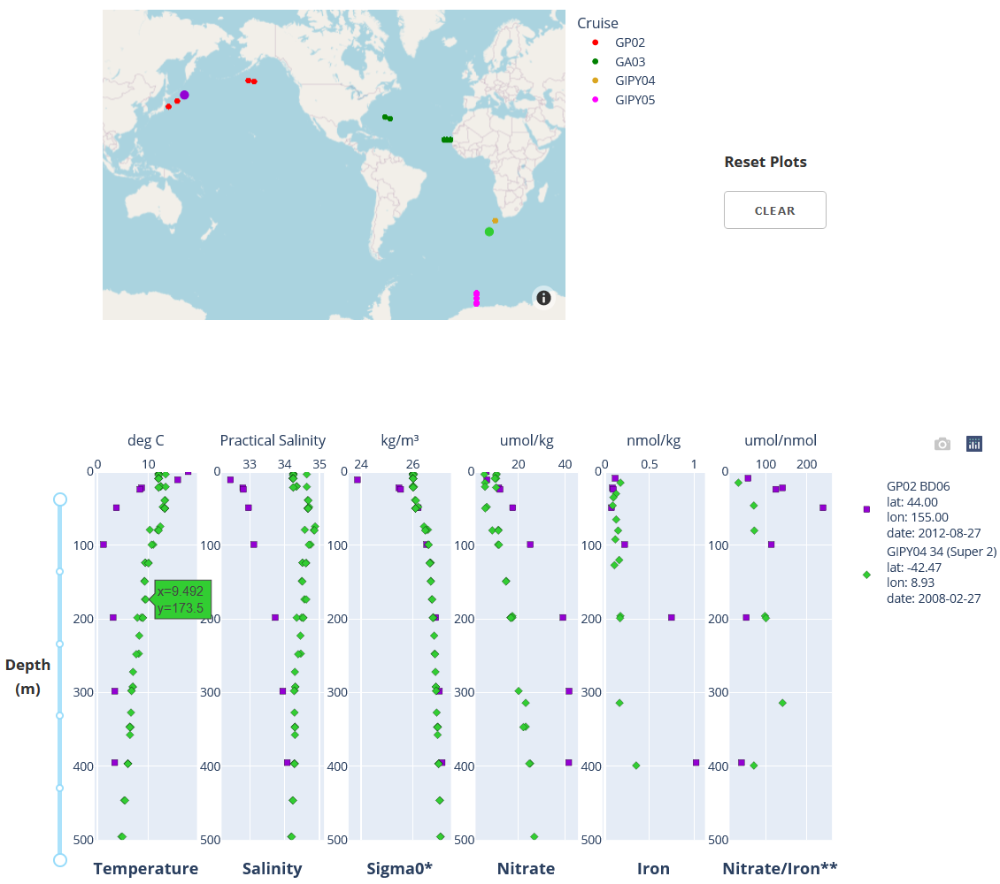
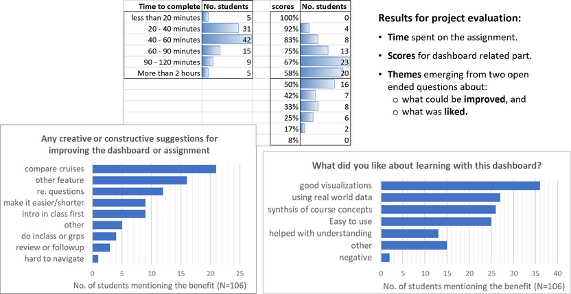

# EOSC 372

## Official course description

**Introductory Oceanography: Circulation and Plankton**: Physical and chemical processes and their controls on the distribution of plankton in the ocean.

**Links:**
\>[Home](https://www.eoas.ubc.ca/academics/courses/eosc372),
\>[UBC Calendar](https://courses.students.ubc.ca/cs/courseschedule?pname=subjarea&tname=subj-course&dept=EOSC&course=372),
\>[ubcexplore](https://ubcexplorer.io/course/EOSC/372),
\> [EOAS curriculum map](https://www.eoas.ubc.ca/~quest/eoas-only.html).

## OCESE project goals for EOSC 372

* Instructors wanted a tool to rapidly view and compare selected data sets so that students can concentrate on the oceanography concepts without having to fetch data from complex public repositories or interpret visualizations that include much more information than the minimum necessary to illustrate the concepts being studied.
* The assignment requires students to observe & compare trace element & physical properties in the ocean water column from selected locations at both high and low latitudes in 3 oceans.
* The OCESE project team was keen to gain experience using Plotly Dash libraries for displaying selected data sets coupled to their locations on a map.
* This was an early opportunity to collaborate with instructors and practice the workflow necessary for developing assignments and corresponding resources together. The resulting app is our first example of delivering carefully selected data sets for students to explore and apply Earth science concepts.

## Actions taken

* First step was to consult with instructors to refine an existing learning activity and to identify and fetch suitable data sets from the extensive, publically available [GEOTRACES data products](https://www.sciencedirect.com/science/article/pii/S0009254118302961?via%3Dihub).
* A first version data-viewer was prepared. Several iterations were required to refine the data display, and to learn how the PlotlyDash plotting library manages data. This proved challenging due to Plotly's techniques for managing data (i.e. memory) between dashboard server and the user's browser.
* The assignment was first used by students in fall 2021. Feedback from students was helpful and resulted in fine tuning & simplifying the app's behavior and user experience.
* The second version was used in fall 2022. This second version of the dashboard's interface looks like this:

Details about the interactive interface and the data that is shown are given when the **ocgy-dataviewer** dashboard is run. For links to the dashboard and the GitHub repository with code, see our [dashboard page](dashboards.md).

## Instructors' experiences

Instructors engaged with the development team closely during early stages since they define (and refine) the learning goals of the assignment that uses this dashboard. Early discussions were based on images or animations illustrating design choices. Once a working prototype is deployed, final choices about data, display and interactivity are finalized efficiently.

Instructors can expect more effecient learning and less confusion when students can focus on addressing the important concepts rather than on mechanics of managing disparate data formats or new interfaces.

The dashboard is used as part of a weekly assignment in a 3rd year course for science majors (links above). Since there are over 130 students in the course, they first address the questions with a worksheet, then submit their solutions using an online quiz consisting of related automatically graded questions.

These are some of the questions:

1. Compare the depth of the mixed layer along each of the three transects. What are deepest and shallowest depths and where are they with respect to continental margins?
2. For each transect, at which station(s) do you observe the highest nitrate concentrations in the mixed layer? And the lowest? Can you think of physical/chemical/biological processes explaining these high and low values?
3. At which station(s) do you observe the highest Fe concentrations in the mixed layer? And the lowest? Can you think of physical/chemical/biological processes explaining these high and low values?

>Nitrate to Fe concentration ratios in the upwelled water can be used to identify potential Fe limitation of phytoplankton. When this ratio is > ~5 µmol nitrate per nmol Fe, the phytoplankton are experiencing Fe limitation, and the highest ratios identify regions severely Fe-limited.

4. Knowing this, consider the nitrate / Fe ratios (i.e., µmol nitrate per nmol Fe) at depth, just below the mixed layer, plotted in the farthest plot to the right in the dataviewer. For each transect identify the stations where phytoplankton may be the most Fe-limited. Also the least Fe-limited. What are some of the sources of Fe in those regions?

Many other questions about these data could be posed, addressing learning goals related to the physical and chemical processes in our oceans, and their controls on the distribution of plankton.

## Students' experiences

Did the dashboard serve as an effective and efficient learning resource? The following questions were posed to evaluate the succecss of this project component.

>1. Was the exercise that was facilitated by the dashboard suitably challenging without being too difficult?
>2. Was it "doable" in a reasonable amount of time compared to posing the same questions without the dashboard? (students were asked: "_Approximately how much time did you spend on this Assignment and Quiz?_")
>3. Student were asked: "_What did you like about learning with this dashboard?_"
>4. Student were asked: "_Have you any creative or constructive suggestions for improving this dashboard or the assignment?_"

**Results** from feedback questions posed as part of the assignment that used this dashboard are summarized in the figure below.

**Time to complete** was consistent with expectations for this portion of an assignment that students had a week to complete.

**Scores** were perhaps a little low for a "low stakes" synthesis exercise. This suggests some iteration would be worthwhile to improve clarity or efficiency of questions. It is also possible the relationship between instructions and the final multiple choice questions could be clarified.

**Quotes** from the top two "_What did you like..._" categories:

> "_I like how integrated it is and how it connects all the topics dealt with in this course so far_".

> "_It was interesting and challenging to use real-world data - I saw firsthand the difficulties that one can have in defining the two layers of a two-layer model. It is also really meaningful to see real data supporting trends and predictions learned in class. It was cool to see a profile for nitrate or Fe and not be surprised by it - and even able to explain it!_".

> "_I liked how this dashboard was applying various concepts and using real data from the world oceans. It was quite easy to use and was very clear in instructions_".

**Benefits**: Students evidently found this interactive dashboard resource to be a "good visualization" and easy to use, appreciated the use of real world data, and liked the opportunity it provided for synthesis of course concepts, and generally found it easy to use. Students also offered some thoughtful.

There was little negative feedback, although with 132 students there are inevitably a few who had difficulties with some aspect. Timely teaching assistant support goes a long way to supporting those kinds of difficulties.

## Costs

Regarding design and development:

* The design cycle involved numerous iterations to finalize the data needed, its presentation, and the "look and feel" of this interactive resource. An engaged, commited and education-oriented isntructing team makes this iteration effective and efficient.
* A second round of adjustments first deployment in a real course is probably inevitable, and should be factored in to project planning.
* For this oceanography dashboard, numerous iterations were needed to discover some of the 'tricks' necessary to successful deployment of the Python-based code that uses Plotly-Dash libraries. The styles of interactivity were found to be much more challenging than other dashboards. Code can be examined in the GitHub repository; find links for the "ocgy-dataviewer" dashboard and its repository on our [dashboard page](dashboards.md).
* Implementing as a class assignment requires the dashboard be hosted on a server that can handle over 130 logins.
* Longer term maintenance, deployment and sustainability of dashboard tools requires a server and staff who can maintain it. Instructors can not be expected to handle all the coding and server technology as well as incorporate excellent, evidence-base, student-centric pedagogy.
* Graduate and undergraduate students who have Python coding experience are invaluatble project contributors. They enjoy applying their skills by contributing to resources that make a difference in student learning.

## Lessons learned
Some recommendations:

* After the first use with students, it is helpful to review questions carefully to fine tune for efficiency and clarity. The goal is to bring the success rate for this kind of "low stakes" synthesis activity up to closer to 80%.
* Varying the questions is also recommended, perhaps changing the emphasis from year to year and building a pool of questions (or question sets) for subsequent use.
* From the development perspective, this dashboard was challenging. It is also a bit slow, and it might benefit from having someone with expertise in use of Plotly Dash libraries review and recommend adjustments to improve efficiency and code clarity.

Further use of Jupyter Notebooks (aka "Jupyter Practicals") is anticipated for EOSC 372, 373, 472 starting in the 2023W teaching season. One pathway forward could be to identify a graduate student who is keen on programing and education. They can provide the energy and time that research faculty may find difficult to devote to develpment of these kinds of resources.