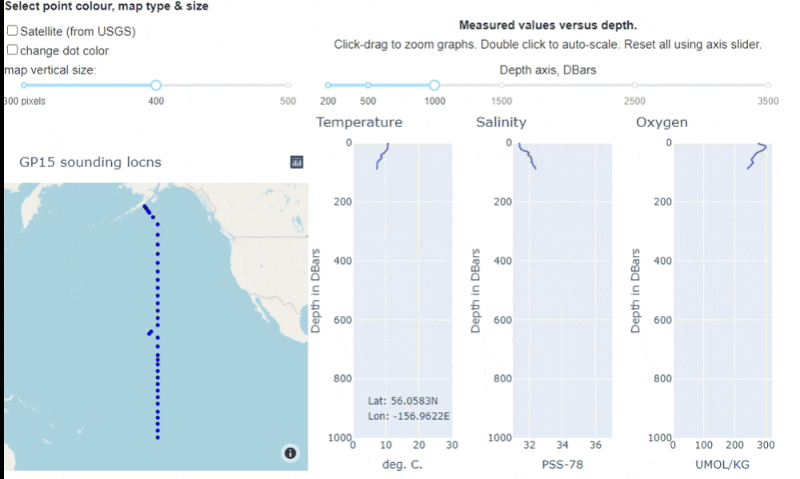

# Dashboard learning resources

## Building and deploying dashboards

**What are "dashboards"**? These are interactive mathematical or data exploration applications hosted online and used in any standard browser. They are used by instructors and students or other learners to explore complex data sets or experiment with challenging concepts.

This page will eventually provide guidelines and pointers to documentation for building and deploying dashboards for use in classes, student activities or assignments. But first some examples:

## Examples will be shown that explore...

* scientific natural concepts and processes
* data processing concepts
* complicated or extensive data sets
* mathematical or analysis techniques

## Dashboard development progress as of January, 2021

The following dashboards were developed for [ENVR 300, Introduction to Research in Environmental Science](https://www.eoas.ubc.ca/academics/courses/envr300). Two have been tested in class with some student and instructor feedback gathered. Lessons learned will be incorporated into futur dashboards.
* **MaunaLoa CO2**
  * Goals: Have students explore the capabilities and limitations of **linear models based on measurements** for explaining or predicting a time-varying physical phenomenon.
  * Used as a classroom activity in ENVR 300, February 2021. Student feedback was obtained to inform further use, and potential upgrades.
  * GitHub [location](https://github.com/fhmjones/envr-300-monaloa).
  * Installed for use [here](https://hub.envr300.portal.eoas.ubc.ca/services/external/envr-300/monaloa/), although this is likely to change.

* **Three Signals**
  * Goals: Demonstrate to students how various components can contribute to a complete timeseries signal. Currently, the procedure involves a sine wave, linear trend, random noise and smoothing of the result using a 5-pt moving average. Each can be enabled or disabled. Length of the sinewave can be adjusted from 1 to 10 cycles, and noise level can be adjusted.
  * Used as an optional at-home activity in ENVR 300, February 2021. Student feedback was obtained to inform further use, and potential upgrades.
  * GitHub [location](https://github.com/fhmjones/envr-300-3signals).
  * Installed for use [here](https://hub.envr300.portal.eoas.ubc.ca/services/external/envr-300/three-signals/), although this is likely to change.

* **Vancouver Ozone**
  * Goals:
    - Have students practice working with "messy" data sets using a year of ozone measurements from two sensors in SW British Columbia.
    - Compare one year of ozone measurements at two locations, one near the ocean and one inland. "Why might inland ozone differe from that measured near the coastline?"
    - Compare raw, 7-day moving average and daily maximum 8-hr average. "Which makes what you want to learn most clearly visible?"
    - Explore impacts of plotting options on interpretability (eg. dots, lines, both).
  * Not yet used by stduents, but represents an example of a "data exploration" app that can inspire other apps for other courses.
  * GitHub [location](https://github.com/fhmjones/envr-300-ozone).
  * Installed for use [here](https://hub.envr300.portal.eoas.ubc.ca/services/external/envr-300/ozone/), although this is likely to change.

* **Oceanography**
  * Goals: Plot depth profiles based on sounding location chosen from locations given on an accompanying map. Uses data from GEOTRACE GP15. Students can compare temperature, pressure and salinity along a line of soundings from Alaska to the equator.
  * Not yet used. Created as demonstration of interactive maps and trace plotting.
  * GitHub [location](https://github.com/fhmjones/eosc-372).
  * This animiation gives a rough idea of functionality.   >Mouse-over a sounding on the map; >corresponding temperature, salinity & oxygen vs depth are plotted. >Adjust depth axes or map parameters; >zoom/pan in each map or plot. >Other behaviors could be programmed to suit educational needs.
  
  * Not yet installed for use.

* **Interactive sketching app**
  * Goals: Ask students to sketch features on a given image then save and submit for assessment. This simple version allows students to draw lines only on a geological timescale image, to indicate age spans of several species identified from fossils in a paleontology lab.
  * Not yet used - generated for demonstration purposes only.
  * GitHub [location](https://github.com/fhmjones/dash_ImageAnnot01).
  * Not yet installed.
  
* For [EOSC 340, Global Climate Change](https://www.eoas.ubc.ca/academics/courses/eosc340), existing web-based climate modelling codes are being adapted for dashboard deployment, and have been piloted during the winter term, 2021.

---

## Getting started

First section will include these requirements:

* Environment for develpment
* Python libraries, some required, others optional
* Options: using `ipywidgets`, the `Dash framework`, or perhaps other options for user interactions. This doc should summarize how to make a decision.
* Buidling dashboard "apps" - code
* Building dashboard "apps" - design criteria for optimal learning
* Using apps - Voila and deployment to servers using containers.

## Environment for develpment

yet to be written

## Python libraries

yet to be written

## Code

yet to be written

## Design criteria

yet to be written

## Deploying dashboards

Details yet to be written, but sections will likely include something like the following:

### To run only on your own computer

This choice makes sense when you are experimenting with the dashboard or planning (if only temporarily) on using it for presentations for a class or presentation.

### Deploy as a Dash-based app.

The app is accessible via a URL on a publically visible server. Each user gets their own dashboard environment, but calls from individual users to the underlying python code are all run by the same python kernal, and specific results are returned just to the specific requesting user.

There are other ways of deploying dashboards, but we are currently focusing on using Dash.

## References and resources

* [Here is a](https://towardsdatascience.com/bring-your-jupyter-notebook-to-life-with-interactive-widgets-bc12e03f0916) reasonably complete, succinct introduction to `ipywidgets` dated May 3, 2019. This article is at "towardsdatascience.com" which is delivered as part of a subscription to the [Medium](https://medium.com/) digital publishing group. (But you can see this using an incognito browser window as often as you like ... )
* ipywidgets [documentation](https://ipywidgets.readthedocs.io/en/latest/) although, like many docs, it is a technical reference, not a tutorial. 
  * See in particular the [using interact](https://ipywidgets.readthedocs.io/en/latest/examples/Using%20Interact.html) page.
* others?
