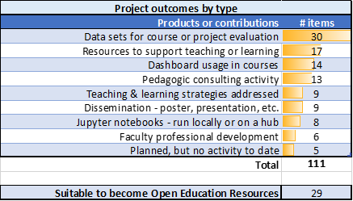
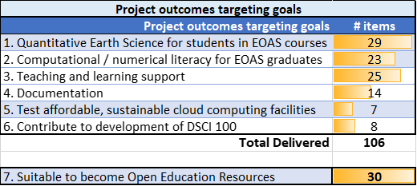
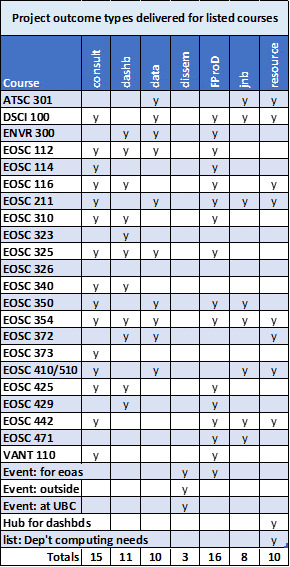
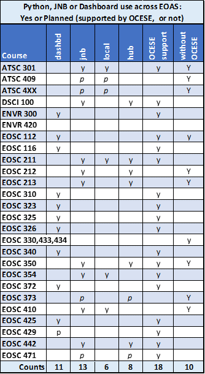

# OCESE project outcomes summary

Update figures. Also use some of _"showcase outline 230314.docx"_.

## Tables summarizing project output

The list of products or contributions generated during the OCESE project includes over 110 items, characterized into eight types of outcomes:

---
Alternatively, outcomes can be listed to show how they contributed towards meeting the six principle project goals:

---
Individual courses benefitted from products or contributions as follows:

Key to column labels:

* consult = Consulting regarding assignment design or pedagogy
* dashb = One or more dashboards introduced
* data = Data gathered to inform instructors about impacts.
* dissem = Dissemination for department, institution or external settings.
* FProD = Supporting faculty professional development (learning new tactics, etc.)
* jnb = One or more Jupyter notebooks introduced.
* pedag = Support for developing pedagogic initiatives
* resource = Resources for teaching or content for learning

---
Courses using dashboards or Jupyter Notebooks on local (own) computers or cloud-based hubs.

---

## Summarized outcomes by project goals

Courses that have been impacted by OCESE project work, and other outcomes, are listed under sections for each of 7 project goals.

### 1. Quantitative Earth Science for all EOAS students

Courses (EOAS "service" courses) with enhanced engagement of **quantitative concepts** or **datasets** include:

>DSCI100, EOSC112, EOSC116, EOSC310, EOSC325, EOSC326, EOSC340, EOSC372, EOSC425, EOSC442.

Courses that have integrated the use of **dashboards** into their classroom work or assignments include:

>ENVR300, EOSC112, EOSC116, EOSC310, EOSC323, EOSC325, EOSC326, EOSC340, EOSC372, EOSC425, EOSC429.

### 2. Computing for students pursuing EOAS degrees

Courses incorporating **Python** and **Jupyter Notebooks** into student learning include:

* Students install Python and Jupyter on their own computers:

  >ATSC301, EOSC211 (optional), EOSC354, EOSC410/510.

* Students run notebooks on cloud-based Jupyter hubs (either UBC or 2i2c hubs):

  >DSCI100, EOSC211, EOSC213 (using CoLab), EOSC212 (OCESE not involved), EOSC350, EOSC442, EOSC471 (starting 2024).

Courses in which students use (or will likely use) **coding** as part of learning. Not all had OCESE support. (Based on the Dep't computing needs [s](https://docs.google.com/spreadsheets/d/1Lg9wLZYwIHSVyXzFPO3096d8eLvL6oLn9lShOosBBok/edit#gid=0)preadsheet as of 23/03/08, so may be incomplete.)

>ATSC301, ATSC409, ENVR420, EOSC211, EOSC212, EOSC213, EOSC353, EOSC354, EOSC410/510, EOSC450, EOSC453, EOSC471, EOSC4xx (climate physics, new 2023/4).

### 3. Open Source Resources (OERs) and pedagogies

All dashboards, course content (such as texts) and project tutorials or documentation emerging from the OCESE project are expected to be designated as OERs, assuming permission from stake holders is obtained.

Resources that are NOT expected to be designated as OERs include those that have solutions to student work or activities.

Regarding automating assessments, the following courses have integrated some aspects of managing or automating assessments:

>ATSC301, DSCI100, EOSC211, EOSC325, EOSC340

### 4. Cloud computing facilities

Project outcomes associated with implenting cloud computing facilities to host student learning activities are essentially "lessons learned" and documented procedures for deploying or using hubs for Jupyter notebooks or servers for dashboards.

### 5. Training materials and documentation

Some resources are targeted towards students, some for instructors or teaching assistants and some for all three. All are being accumulated at the website you are viewing now. See also Faculty Development below.

### 6. Support development of a python version of DSCI 100

DSCI100 is taught in the UBC Department of Statistics, but this new Python section was first taught by Prof. L. Heagy of the Dep't of EOAS in winter 2023. This major course adapation involved the following activities carried out between 2021 and 2023.

* Adapting the R-based textbook to Python.
* Adapting all learning worksheets from R to Python.
* Adapting teaching materials (slide decks, classroom materials, etc.) from R to Python.
* Teaching the first "Python cohort" of this course.

### 7. Faculty development

The original project proposal anticipated carrying out facultly professional development with workshops and tutorials. Instead, during COVID, the only information sessions were short online presentations at Department meetings.

However, instructors teaching courses involved in the project received more or less extensive support from project team and teaching assistants while adjustments or resources were being developed.

Now, with the project tasks essentially completed, we anticipate that training for groups of faculty can be expected to occur between May and December 2023.

---

## Table of courses impacted by OCESE

Courses that were supported by OCESE project components.

|Course|Title|Students; 3yrs|Contributions|Comments|
|:---|:---|:---:|:---|:---|
| ATSC301 | Atmospheric Radiation and Remote Sensing                        | 37   | Python, JNB, Jbooks, GitHub                              | Essentially done prior to OCESE; served as precedent. |
| DSCI100 | Introduction to Data Science                                    | 69   | Adapt R-based course to Python                           | Major adaptation: "R" to Python, complete textbook, worksheets, assignments and assessments. First taught Jan-Apr, 2023. |
| ENVR300 | Introduction to Research in Environmental Science               | 174  | Dashboard(s)                                             | 3 made, 2 used. |
| ENVR420 | Ecohydrology of Watersheds and Water Systems                    | 0    | R to Python & Jupyter notebooks (JNBs)                   | Not started after discussion with instructor. |
| EOSC112 | The Fluid Earth: Atmosphere and Ocean                           | 258  | Dashboard(s) & class activity consulting                 | Section 101 only, secn 201 not affected. |
| EOSC116 | Mesozoic Earth: Time of the Dinosaurs                           | 1436 | Dashboard(s)                                             | 2021W: DE only. 2022W: online and face to face versions. |
| EOSC211 | Computer Methods in Earth, Ocean and Atmospheric Sciences       | 297  | Convert from MatLab to Python, JNBs, Jbooks, autograding | Major transformation: MatLab to Python, autograding, worksheets, assignments, labs, assessments. Significant contribution from teaching assistants. |
| EOSC310 | The Earth and the Solar System                                  | 341  | Dashboard                                                | 2021W, online section only. |
| EOSC325 | Principles of Physical Hydrogeology                             | 118  | 3 dashboards & consulting                                | New course, 2021W. |
| EOSC340 | Global Climate Change:                                          | 310  | Dashboard(s) & question management                       | 2021W: prairielearn. 2022W: prairielearn + CMIP6 dashboard. |
| EOSC350 | Environmental, Geotechnical, and Exploration Geophysics I       | 119  | Online conversion; Hubs                                  | Pre-existing suite of dashboardapps. 2020W: online "field" labs. 2021W: hub only. 2022W: hub only. |
| EOSC354 | Analysis of Time Series and Inverse Theory for Earth Scientists | 20   | Convert from MatLab to Python & JNBs                     | 10 assigs: JNBs + workflow for delivery and assessment. |
| EOSC372 | Introductory Oceanography: Circulation and Plankton             | 289  | One dashboard                                            | Properties of ocean column. |
| EOSC425 | Palaeontology                                                   | 30   | Dashboard                                                | One only. |
| EOSC429 | Groundwater Contamination                                       | 75   | Dashboard                                                | In progress 2023. |
| EOSC442 | Climate Measurement and Analysis                                | 44   | Convert MatLab labs to Python & JNBs                     | All four computing labs. |
| EOSC471 | Waves, Currents and Ocean Mixing                                | 18   | Convert MatLab assignments to Python with JNBs           | In progress 2023. |
|         | Total numbers of students impacted over 3 years                 | **3635** | | |
